# Stepan Oksanichenko

Python developer & infrastructure engineer based in Ukraine.  
Working at [CloudLinux](https://cloudlinux.com).  
One of the early developers of [AlmaLinux OS](https://almalinux.org) and co-author of [mirrors.almalinux.org](https://mirrors.almalinux.org).

---

## Stack

**Languages** · Python · Bash  
**Frameworks** · Flask · SQLAlchemy  
**Infra** · Docker · Ansible · Terraform · Linux  
**Packaging** · RPM · DEB

---

## Links

- 🌐 [zelgray.work](https://zelgray.work)
- 🔑 PGP keys — [zel.gray@gmail.com](https://keys.openpgp.org/vks/v1/by-fingerprint/6DCF4D5CB21A2B54FD130F1C23D2D95A234D6F29) · [soksanichenko@almalinux.org](https://keys.openpgp.org/vks/v1/by-fingerprint/A88CC66CAC87EFF15146816BAB9983172AB1E45B) · [soksanichenko@cloudlinux.com](https://keys.openpgp.org/vks/v1/by-fingerprint/221FE236F560C454D5629B5BF897A475E13A9907)

---

ZelGray · Cherkasy, Ukraine
